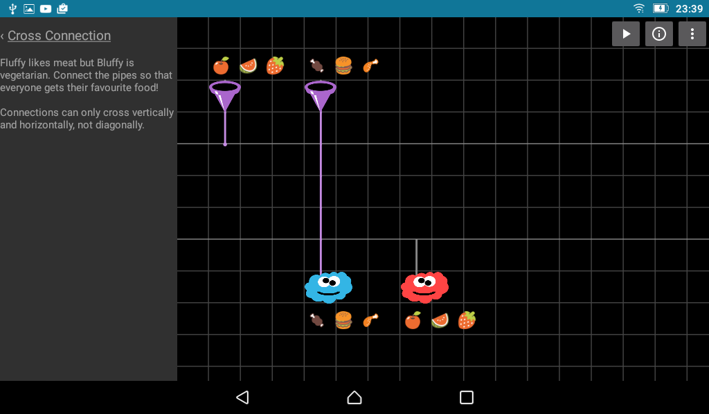

# FlowGrid

FlowGrid is a visual dataflow programming environment for Android. The main difference to other
visual programming apps such as [Scratch](https://scratch.mit.edu/) is that FlowGrid is based on
modelling data flow directly instead of traditional structured programming.

Basically, instead of using an indirection via variables or registers, the flow of information
through the computer is modelled in a graph, making programs look more like flow chart diagrams.
At the top level, this flow can be easily visualized, potentially making programming also more
accessible.

When the program is executed, flowgrid shows the flow of information through the program:

## Where is the App?

Download the public alpha from <https://play.google.com/store/apps/details?id=org.flowgrid>.

## What is it good for?

The main motivation for building FlowGrid was that text input is quite horrible on most
mobile devices. So I wanted to explore a different approach to programming that is a better
fit for a touch based interface. The inspiration for using a grid to make sure that the programs
look relatively tidy came from MineCraft and "Flow Free"-style mobile games.
Building something like IFTTT crossed with Redstone blocks on steroids just seemed like a
natural fit for tablets and phones.

Possible applications are:

- Simple simulations, converters or games
- Apps utilizing or rendering device sensor data
- Controlling an Arduino board via Firmata (requires a device with USB OTG support)
- Real [spaghetti code](img/spaghetticode.png) :)

Also, the "missions" should make it easy to learn programming with a data flow paradigm.

I haven't built a turing machine in FG yet, but I am quite confident it is computational
complete since it supports recursion.

## What is it not so good for?

FlowGrid is currently not really suitable for data- or UI heavy apps. While it is possible to 
create home screen icons for individual FG progams, it's not really easy to share apps yet.

## Tutorials (aka "Missions")

To get a basic understanding of the editor and concepts, FlowGrid provides a set of increasingly
sophisticated tutorials in the “missions” section of the App. Before diving deeper into developing
custom programs with FlowGrid, I’d recommend to play through some of them to become familiar with
the operation editor.

## Feedback?

If you have any feedback, please don't hesitate to send me feedback via stefan@flowgrid.org,
[file an issue](https://github.com/FlowGrid/flowgrid/issues) or to join the corresponding
[G+-group](https://plus.google.com/u/0/communities/111282708416188636080).

## Source Dependencies

FlowGrid Android depends on:

- https://github.com/kobjects/emoji

## Language Concepts, Editor and API documentation

Links:

- [Language concepts](https://github.com/FlowGrid/flowgrid/blob/master/flowgrid-android/src/main/assets/documentation.md)
- [User interface](https://github.com/FlowGrid/flowgrid/blob/master/flowgrid-android/src/main/assets/ui.md)
- [System library](https://github.com/FlowGrid/flowgrid/blob/master/flowgrid-android/src/main/assets/api.md)

## Creating and Managing Missions

In "About" in the main menu, tap on the text several times. This will turn on developer mode,
enabling all missions and extra menu entries. In particular "Add..." will be added to the
context menu in the list of missions, allowing for the addition of new missions.

To add new input and expectations to your own mission, tap on a free field for the options to be shown. 
The visualizations in form of the pipes and monsters for input and output can be found if you tap 
"Data/IO" and after that "Test".

In each individual Mission, "Tutorial mode" can be turned off, which will show the
"Tutorial settings" menu, including an option to change the order of missions.
